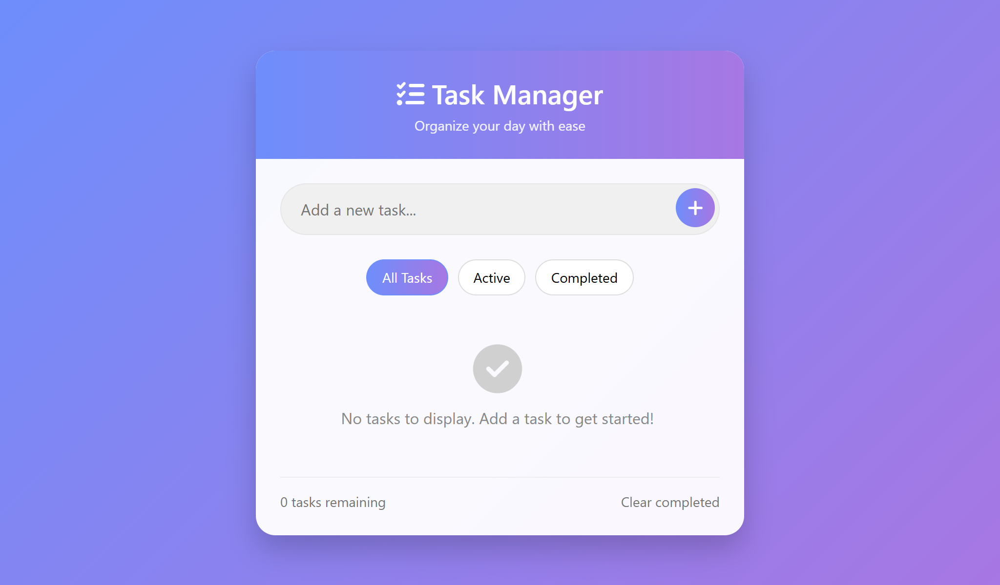
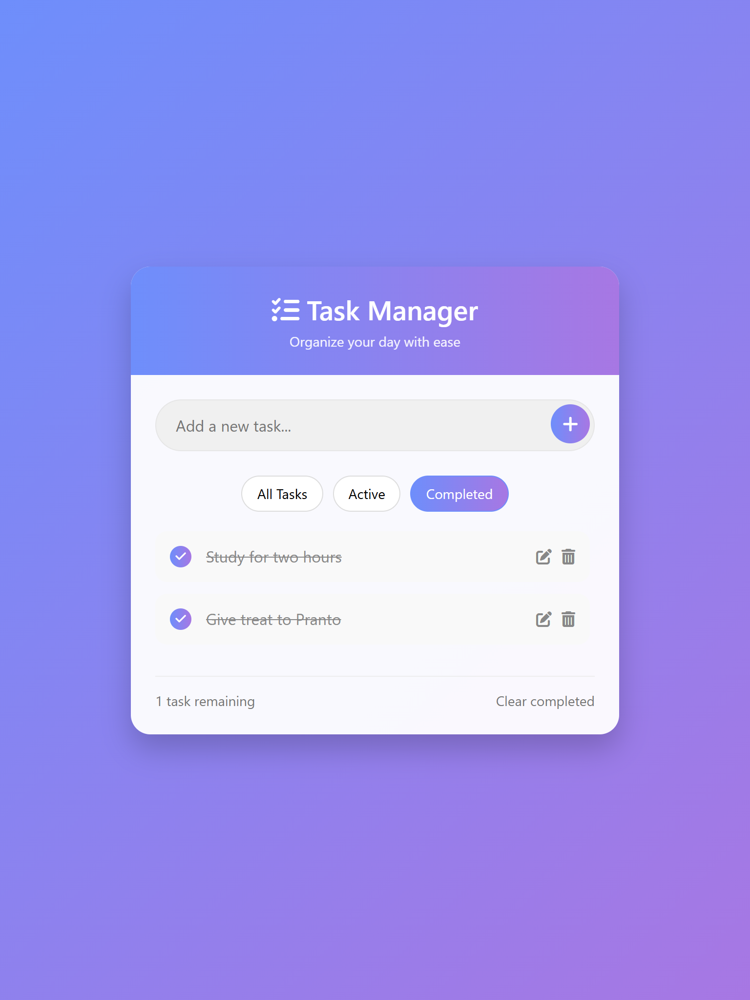
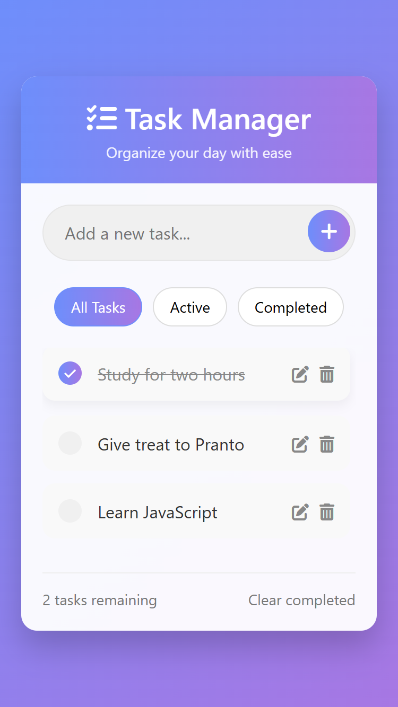

# 📘 Day 11 - Task Management App (with LocalStorage + Animations)

<p align="center">
  
  
  
  
</p>

<p align="center">
Welcome to **Day 11** of my **60 Days of Coding Challenge**!  
Today, I built a **Task Management App** — a feature-rich upgrade from a simple to-do app.  
It comes with **add, update, delete tasks**, persistent storage using **LocalStorage**, and smooth **animations** for a better user experience. 🎉
</p>

---

## 🔗 Live Demo

👉 [Click here to try the app](https://prantos-task-manager.netlify.app/)

---

## ⚡ Tech Stack

<p align="center">
  
  
  
</p>

---

## 🎨 Features Implemented

- ✅ **Add Tasks** → instantly add new tasks with input field
- ✅ **Update Tasks** → edit existing tasks with ease
- ✅ **Remove Tasks** → delete tasks individually
- ✅ **LocalStorage Support** → tasks remain saved even after page reload
- ✅ **Input Validation Support** → supports validation before task insertion
- ✅ **Beautiful Design** → modern UI with polished layout & colors
- ✅ **Smooth Animations** → task addition/removal with transitions

---

## 📚 Topics Revised

- 🔹 DOM Manipulation (`getElementByID`, `querySelector`, `createElement`, `appendChild`)
- 🔹 **Event Listeners** (`click`, `change`, `keypress`)
- 🔹 **LocalStorage** → `setItem()`, `getItem()`
- 🔹 **CSS Animations** & Transitions for smooth effects
- 🔹 **CRUD Operations** → Create, Read, Update, Delete tasks

---

## 🛠️ Practice Work

- Designed a **clean and responsive UI** for the app.
- Implemented **task creation & rendering** dynamically with DOM.
- Used **LocalStorage** to save tasks permanently.
- Added **animations** when tasks are added, updated, or removed.
- Practiced **DOM updates** for live editing of tasks.

---

## 📂 Folder Structure

```plaintext
Day-11/
├── index.html       # HTML structure of the app
├── style.css        # Styling & animations
├── script.js        # Task management logic with LocalStorage
└── README.md
```

---

## 🚀 Output Highlights

- ✨ Tasks can be added, updated, and deleted in real-time

- ✨ Data is persisted with LocalStorage

- ✨ Smooth animations make interactions visually appealing

- ✨ Polished UI for a professional-looking task manager

---

## 🎥 Preview

<p align="center">
  
</p>

<p align="center">
  
</p>

<p align="center">
  
</p>

---
## 🔗 Next Step

- 👉 Day 12: Async JavaScript — fetch, promises, async/await, and working with APIs.

---
