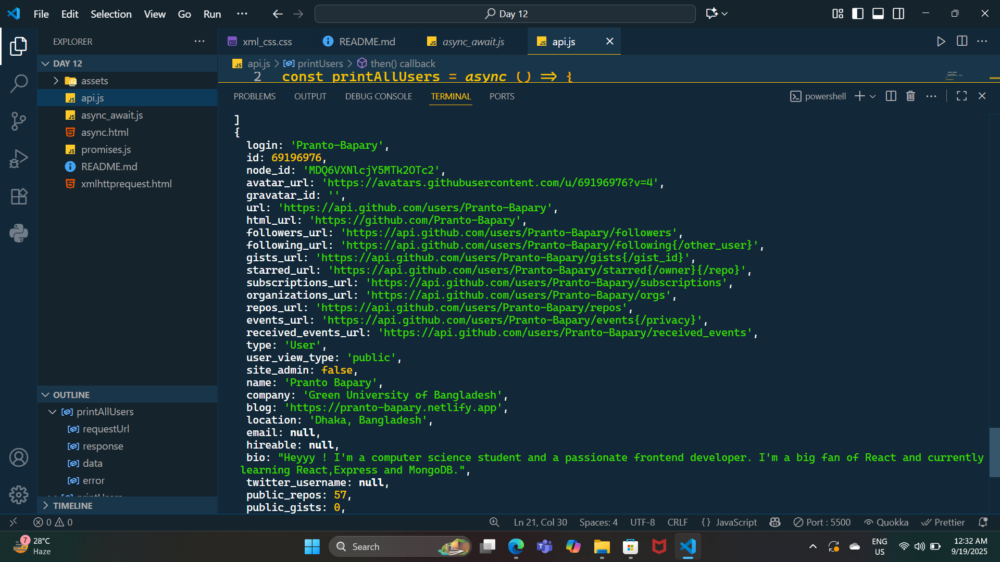

# 📘 Day 12 - Async JavaScript (Promises, Fetch, Async/Await & APIs)

<p align="center">
  
  
  
  
  
  
</p>

<p align="center">
Welcome to **Day 12** of my **60 Days of Coding Challenge**!  
Today, I practiced **Asynchronous JavaScript** in depth: exploring **Promises, Fetch API, Async/Await, and XMLHttpRequest**.  
As a hands-on project, I also built my own **GitHub API Stats Card** that fetches live user data from the GitHub API and displays it dynamically. ⚡
</p>

---

## 🔗 Live Demo

👉 [Click here to view my GitHub Stats Card](https://prantos-github-api-card.netlify.app/)  

---

## 🎨 Features Implemented

- ✅ Practiced **Promises** with `.then()` and `.catch()`  
- ✅ Used **Fetch API** to call public APIs and log responses  
- ✅ Converted promise chains into **async/await** for cleaner syntax  
- ✅ Practiced **XMLHttpRequest (XHR)** for legacy API requests  
- ✅ Built a **GitHub Stats Card**:
  - Displayed my GitHub profile data dynamically (name, bio, followers, repos, etc.)
  - Styled the card with HTML & CSS
- ✅ Added **error handling** with `try...catch` and XHR error events  

---

## 📚 Topics Revised

- 🔹 **Promises**
  - States → pending, fulfilled, rejected
  - `.then()`, `.catch()`, `.finally()`
- 🔹 **Fetch API**
  - Chaining with `.then()` → parsing JSON
- 🔹 **Async / Await**
  - Cleaner syntax for fetch calls
  - Error handling with `try...catch`
- 🔹 **XMLHttpRequest (XHR)**
  - `.open()`, `.send()`, `.onreadystatechange`
  - Handling API responses in old-school style
- 🔹 **GitHub REST API**
  - Endpoint: `https://api.github.com/users/<username>`
  - Extracted JSON response → rendered profile data

---

## 🛠️ Practice Work

- Wrote **Promise examples** to simulate async tasks.  
- Called different test APIs (JSONPlaceholder, Dummy APIs) with **Fetch API**.  
- Converted them into **async/await** functions for better readability.  
- Practiced **XMLHttpRequest** to fetch and log API data manually.  
- Built a **GitHub API Stats Card** that fetches live GitHub data and renders it in a styled card layout.  

---

## 📂 Folder Structure

```plaintext
Day-12/
├── assets              # css and screenshots files
├── api.js              # fetch api with promise & typical async await approach
├── async_await.js      # async await practice
├── promises.js         # practiced promises
├── xmlhttprequest.html # async javaScript practice code
└── README.md
```
---
## 🚀 Output Highlights

- ✨ Learned to handle async operations with both Promises and async/await

- ✨ Practiced legacy API requests using XMLHttpRequest

- ✨ Successfully fetched and displayed live GitHub profile data

- ✨ Built a polished GitHub Stats Card with API integration
---

## 🎥 Preview

** GitHub API Stats Card **

<p align="center">  </p>

** Console Logs **

<p align="center">  </p>

---