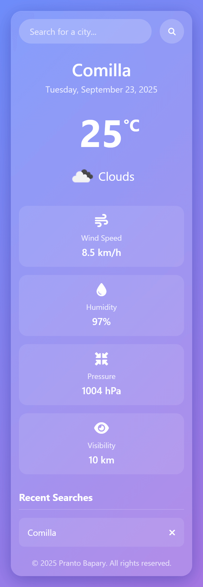
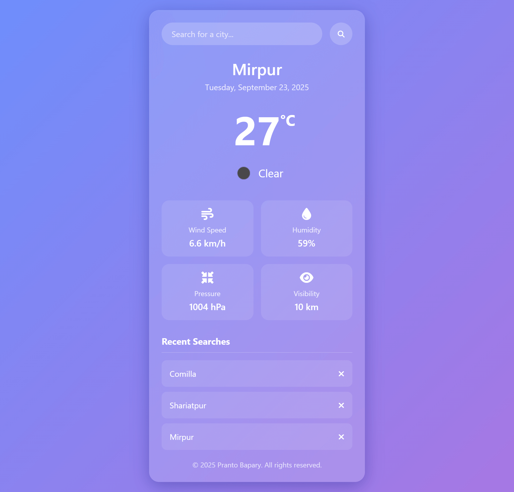

# 📘 Day 14 - Weather App (with LocalStorage Support)

<p align="center">
  
  
  
  
  
</p>

<p align="center">
Welcome to **Day 14** of my **60 Days of Coding Challenge**!  
Today, I built a fully functional **Weather App** 🌤️ that fetches live weather data from the **OpenWeatherMap API**.  
It comes with **LocalStorage support** to save and display recently searched cities/locations, so you can revisit your weather history anytime! ⚡
</p>

---

## 🔗 Live Demo

👉 [Click here to try my Weather App](https://prantos-weatherapp.netlify.app/)

---

## 🎨 Features Implemented

- ✅ **Search City/Location** → fetches live weather details instantly  
- ✅ **Weather Details Display** → temperature, condition, icon, etc.  
- ✅ **Recent Searches** → saves your last few searched cities in **LocalStorage**  
- ✅ **Persistent Data** → previous searches remain even after refreshing the page  
- ✅ **Responsive Design** → works smoothly across desktop, tablet, and mobile  
- ✅ **Modern UI** → clean and visually appealing design  

---

## 📚 Topics Revised

- 🔹 **Fetch API** → get weather data from OpenWeatherMap  
- 🔹 **Async / Await** → clean async code for API calls  
- 🔹 **LocalStorage** → save & retrieve recent searched cities  
- 🔹 **DOM Manipulation** → dynamically render weather results  
- 🔹 **Event Handling** → search input, button clicks  
- 🔹 **Responsive CSS** → mobile-friendly layout  

---

## 🛠️ Practice Work

- Designed a **search input & result display** for weather data.  
- Integrated **OpenWeatherMap API** using `fetch` with **async/await**.  
- Implemented **LocalStorage** to store and display the last few searched cities.  
- Styled the app with **responsive CSS** for a modern look.  
- Practiced **error handling** for invalid city names.  

---

## 📂 Folder Structure

```plaintext
Day-14/
├── assets/          # Screenshots, icons, or extra assets
├── netlify/         # Netlify deployment configuration files
├── index.html       # Main Weather App file
├── netlify.toml     # Netlify build & deploy settings
└── README.md        # Project documentation
```

---

## 🚀 Output Highlights

- ✨ Live weather results with temperature, condition & icons

- ✨ Saves recent searches in LocalStorage

- ✨ Mobile-friendly and visually appealing design

- ✨ API integration with smooth async handling

---

## 🎥 Preview

**Weather App Screenshot Mobile**

<p align="center">
  
</p>

**Weather App Screenshot Desktop**

<p align="center">
  
</p>


---

## 🔗 Next Step

- 👉 Day 15: React Basics — setup React, JSX, functional components, and props.

---