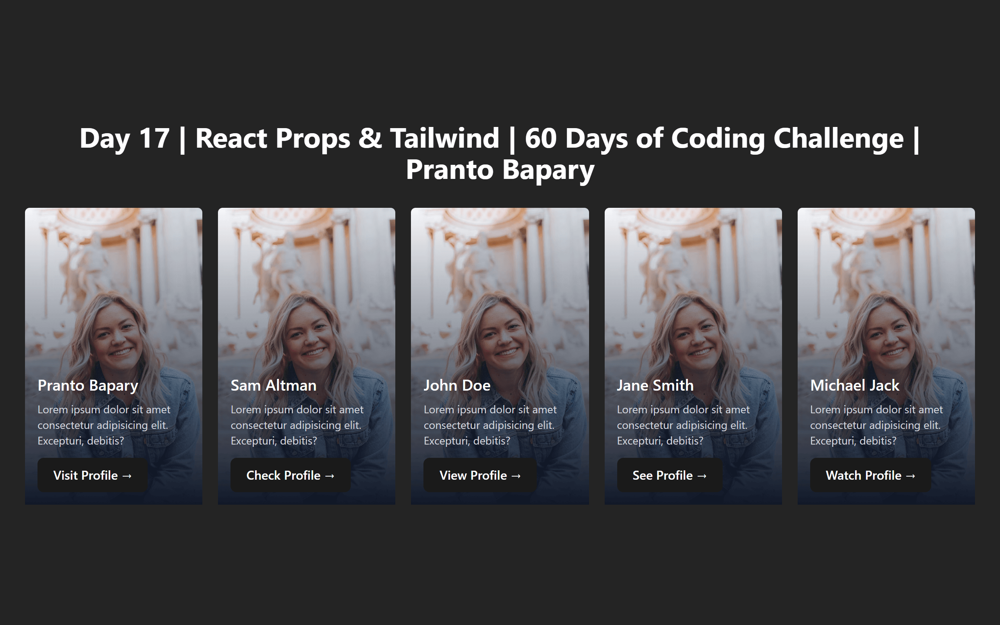
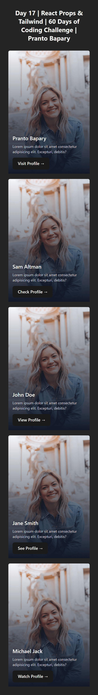

# 📘 Day 17 - React Props & Tailwind CSS Responsive Cards  

<p align="center">
  
  
  
  
  
</p>

<p align="center">
Welcome to <b>Day 17</b> of my <b>60 Days of Coding Challenge</b>!  
Today, I learned the power of <b>React Props</b>, how to pass data between components,  
and also got my hands on <b>Tailwind CSS</b> for the very first time 🎉.  
To put it all together, I built a <b>responsive Card Layout</b> (desktop 5-column, mobile stacked) using props and Tailwind Flexbox.
</p>

---

## 🎨 Key Learnings  

- ✅ What are **props** in React & how to pass data between components  
- ✅ How to send **objects as props** to render dynamic content  
- ✅ Basics of **Tailwind CSS**: setup & configuration with Vite  
- ✅ Responsive design using **Tailwind Flexbox utilities**  
- ✅ Building reusable **Card components** powered by props  

---

## 📚 Topics Revised  

- 🔹 **React Props**
  - Passing primitive values & objects  
  - Rendering dynamic content inside components  

- 🔹 **Tailwind CSS**
  - Setup with Vite (`npm install -D tailwindcss postcss autoprefixer`)  
  - Configuring `tailwind.config.js`  
  - Using responsive utility classes  

- 🔹 **Responsive Flexbox Layout**
  - Creating a **flex container** with multiple card items  
  - Using Tailwind breakpoints (`sm:`, `md:`, `lg:`) for responsive layouts  

---

## 🛠️ Practice Work  

- Created a **Card component** (`Card.jsx`) that accepts props for title, description, and image.  
- Passed an **array of objects** from `App.jsx` to render multiple cards.  
- Styled everything with **Tailwind Flexbox utilities** for responsive layout.  
- Deployed the project live on **Netlify**.  

🔗 **Live Demo:** [React Props Card App](https://react-props-card.netlify.app/)  

---

## 📂 Folder Structure  

```plaintext
Day-17/
├── react-props/
│   ├── src/
│   │   ├── Components/
│   │   │   └── Card.jsx
│   │   ├── App.jsx
│   │   └── App.css
│   ├── index.html
│   ├── package.json
│   ├── package-lock.json
│   ├── vite.config.js
│   └──eslint.config.js
└────── README.md
```

---
## 🎥 Preview
<p align="left">
  

<p align="left">
  
</p>
---

## 🚀 Output Highlights

- ✨ Built reusable Card components with props

- ✨ Practiced object destructuring in props

- ✨ Learned Tailwind CSS basics for rapid UI design

- ✨ Created a clean and responsive 5-column card layout using Flexbox

- ✨ Deployed successfully on Netlify 🎉

---
## 🔗 Next Step

- 👉 Day 18: Explore React State and dynamic UI updates with useState ⚡
---