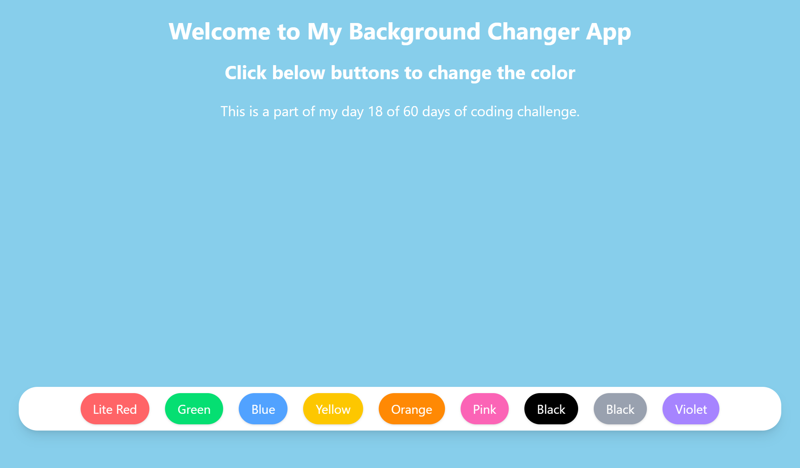

# 📘 Day 18 - React useState Hook & Background Color Changer Project

<p align="center">
  
  
  
  
  
</p>

<p align="center">
Welcome to <b>Day 18</b> of my <b>60 Days of Coding Challenge</b>!  
Today, I deepened my understanding of <b>React Hooks</b>, especially <b>useState</b>, by building a fun and interactive <b>Background Color Changer App</b>.  
I also practiced more with <b>Tailwind CSS</b> to style and make the app fully responsive.  
This project was created using <b>Vite</b> ⚡ and deployed on <b>Netlify</b> 🚀.
</p>

---

## 🔗 Live Demo

👉 [Click here to view my Background Color Changer](https://my-react-bgchanger.netlify.app)

---

## 🎨 Features Implemented

- ✅ Learned and applied **useState hook** for state management
- ✅ Practiced **Tailwind CSS** for utility-first responsive styling
- ✅ Built a **Background Color Changer App** with:
  - 🎨 Change background color on button click
  - 🔄 Dynamically update UI state
- ✅ Created project using **Vite** for faster development
- ✅ Deployed the project on **Netlify** for live access

---

## 📚 Topics Revised

- 🔹 **React Hooks**
  - `useState` → managing dynamic UI state inside functional components
- 🔹 **Tailwind CSS**
  - Utility classes for styling and responsiveness
  - Applying hover effects & transitions
- 🔹 **Event Handling**
  - `onClick` to trigger background color change
- 🔹 **Vite**
  - Setting up a React project with Vite
- 🔹 **Deployment**
  - How to deploy React projects on **Netlify**

---

## 🛠️ Practice Work

- Created a React project with **Vite** (`npm create vite@latest bg-color-changer`).
- Used **useState** to dynamically update the background color.
- Styled the app with **Tailwind CSS utilities** (flex, buttons, hover states).
- Tested random color generation and applied responsive design.
- Successfully **deployed** the app on Netlify.

---

## 📂 Folder Structure

```plaintext
Day-18/
└── bg-color-changer/
    ├── src/
    │   ├── components/       # card / button components
    │   ├── App.jsx           # main app with useState
    │   ├── index.css         # Tailwind base styles
    │   ├── main.jsx          # entry point
    ├── public/               # static files
    ├── index.html
    ├── package.json
    └── README.md
```

---

## 🚀 Output Highlights

- ✨ Hands-on with React useState Hook

- ✨ Built an interactive background color changer

- ✨ Practiced Tailwind CSS for styling and responsiveness

- ✨ Set up the project with Vite

- ✨ Deployed successfully on Netlify 🎉

---

## 🎥 Preview

<p align="left">
  
</p>

---

## 🔗 Next Step

- 👉 Day 19: Explore More React States like useEffect, useRef and useCallback ⚡

---
