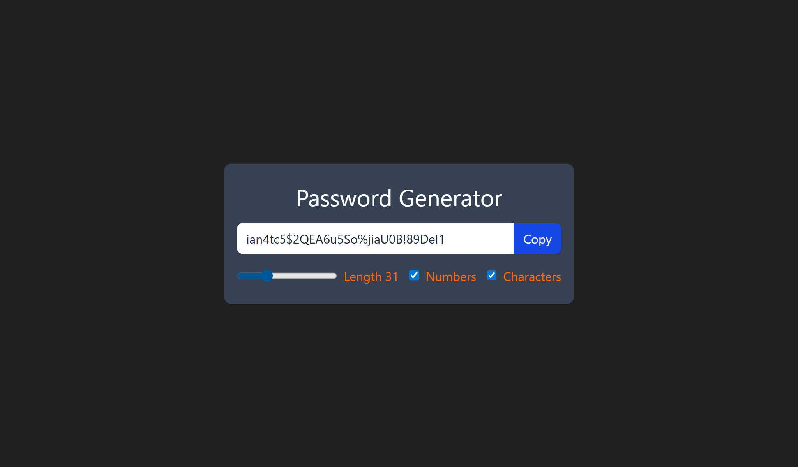
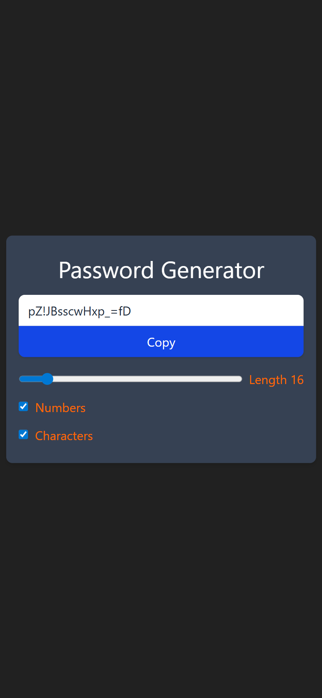

# 📘 Day 19 - React Hooks (useState, useEffect, useCallback, useRef) & Password Generator

<p align="center">
  
  
  
  
  
  
  
  
</p>

<p align="center">
Welcome to <b>Day 19</b> of my <b>60 Days of Coding Challenge</b>!  
Today, I leveled up my React skills by learning and practicing <b>4 important hooks</b>:  
<b>useState, useEffect, useCallback, and useRef</b>.  
Using these, I built an <b>optimized Password Generator App</b> that creates unique and secure passwords ⚡.  
This project was styled with <b>Tailwind CSS</b>, built with <b>Vite</b>, and deployed on <b>Netlify</b> 🚀.
</p>

---

## 🔗 Live Demo

👉 [Click here to view my Password Generator App](https://prantos-password-generator.netlify.app/)

---

## 🎨 Features Implemented

- ✅ Practiced **useState** for managing dynamic state
- ✅ Used **useEffect** for side effects and updates
- ✅ Optimized with **useCallback** to avoid unnecessary re-renders
- ✅ Applied **useRef** for referencing DOM elements
- ✅ Built a **Password Generator App** with:
  - Adjustable password length
  - Option to include numbers & special characters
  - One-click copy functionality
- ✅ Styled the app with **Tailwind CSS** for a modern responsive design
- ✅ Deployed live using **Netlify**

---

## 📚 Topics Revised

- 🔹 **useState Hook** → State management inside components
- 🔹 **useEffect Hook** → Running side effects on state changes
- 🔹 **useCallback Hook** → Performance optimization with memoized functions
- 🔹 **useRef Hook** → Accessing & controlling DOM elements directly
- 🔹 **Event Handling** → Button click & clipboard copy
- 🔹 **Tailwind CSS** → Responsive design with utility classes
- 🔹 **Vite & Netlify** → Fast bundling & deployment

---

## 🛠️ Practice Work

- Created a new React project using **Vite**
- Implemented **password generation logic** with hooks
- Added functionality for **copying password to clipboard** using `useRef`
- Used **useCallback** to prevent unnecessary regeneration
- Styled app with **Tailwind utilities**
- Successfully deployed on **Netlify**

---

## 📂 Folder Structure

```plaintext
Day-19/
└── password-generator/
    ├── src/
    │   ├── components/       # optional components
    │   ├── App.jsx           # main logic with hooks
    │   ├── index.css         # Tailwind CSS styles
    │   ├── main.jsx          # entry point
    ├── public/               # static files
    ├── index.html
    ├── package.json
    └── README.md
```

---

## 🚀 Output Highlights

- ✨ Learned and practiced 4 React hooks in one project

- ✨ Built a fully functional password generator

- ✨ Optimized code with useCallback

- ✨ Implemented clipboard copy with useRef

- ✨ Styled with Tailwind CSS for responsive design

- ✨ Deployed successfully on Netlify 🎉

## 🎥 Preview

<p align="left"> 
 
</p> 
<p align="left">  
</p>

---
