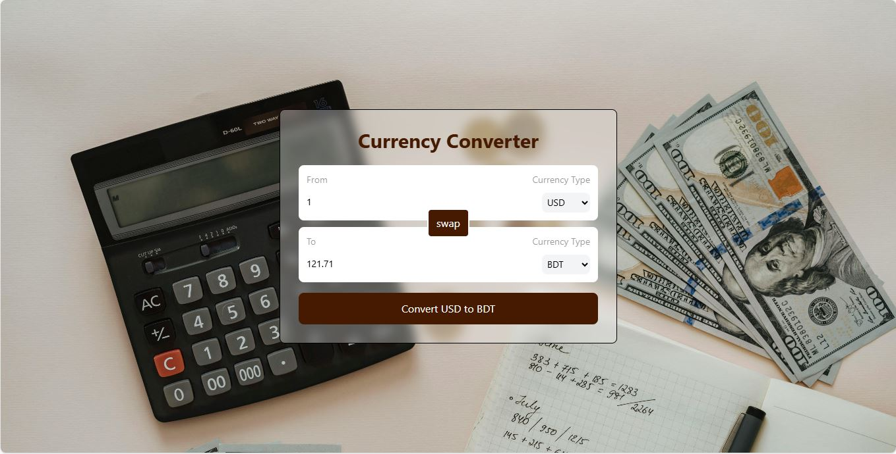
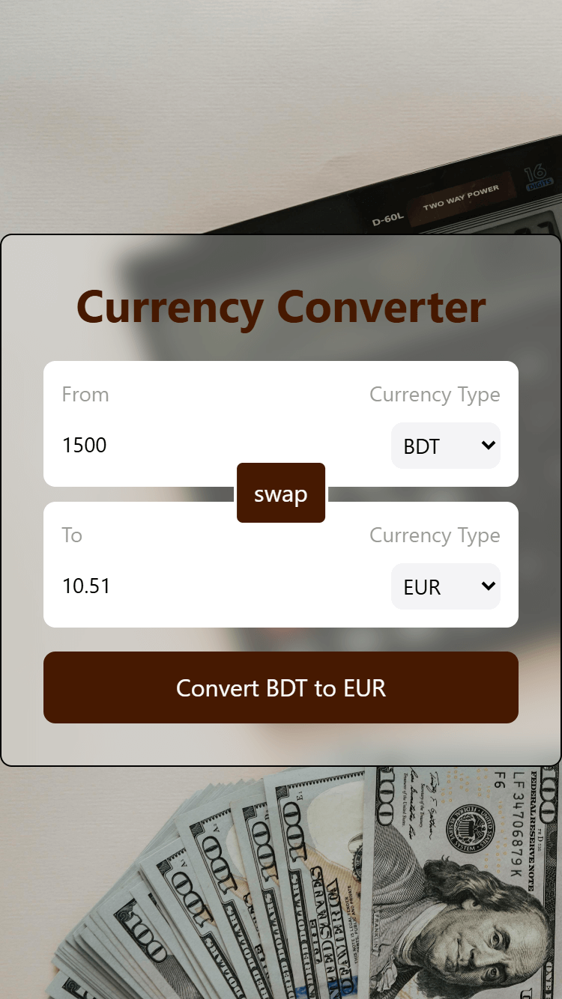

# 📘 Day 20 - Custom Hook, API Integration & Currency Converter App  

<p align="center">
  
  
  
  
  
  
  
  
  
</p>  

<p align="center">
Welcome to <b>Day 20</b> of my <b>60 Days of Coding Challenge</b>!  
Today, I explored how to create and use <b>custom hooks</b> in React while working with real-world <b>API integration</b>.  
As a hands-on project, I built a powerful <b>Currency Converter App</b> 💱 that supports <b>100+ currencies</b>, uses a <b>custom hook (useCurrencyInfo)</b> for fetching live data, and provides seamless real-time conversion.  
Styled with <b>Tailwind CSS</b>, bundled with <b>Vite</b>, and deployed on <b>Netlify</b> 🚀.
</p>  

---

## 🔗 Live Demo  

👉 [Click here to view my Currency Converter App](https://prantos-currency-converter.netlify.app/)  

---

## 🎨 Features Implemented  

- ✅ Practiced **custom hooks** for reusable logic (`useCurrencyInfo`)  
- ✅ Used **useState, useEffect, useId** for managing state & effects  
- ✅ Integrated with a **live currency API** for real-time data  
- ✅ Built a **Currency Converter** that:  
  - Converts between 100+ currencies 🌍  
  - Accepts user input for amount & currency type  
  - Instantly shows converted results  
- ✅ Responsive design with **Tailwind Flexbox utilities**  
- ✅ Deployed successfully with **Netlify**  

---

## 📚 Topics Revised  

- 🔹 **React Hooks**  
  - `useState` → managing form input values  
  - `useEffect` → fetching API data on component mount  
  - `useId` → generating unique IDs for accessibility  
- 🔹 **Custom Hooks**  
  - Created `useCurrencyInfo` to encapsulate API fetching logic  
  - Reusable logic across components  
- 🔹 **API Integration**  
  - Fetched live currency exchange data  
  - Error handling for invalid requests  
- 🔹 **Tailwind CSS**  
  - Responsive form & card styling with Flexbox utilities  
- 🔹 **Vite & Netlify**  
  - Fast bundling & deployment  

---

## 🛠️ Practice Work  

- Built a new React project with **Vite**  
- Developed **Currency Converter** component with form inputs  
- Created a **custom hook (useCurrencyInfo)** for API data fetching  
- Used **React hooks** for input handling, effects & unique IDs  
- Styled UI with **Tailwind utilities** for responsive design  
- Deployed on **Netlify** with live access  

---

## 📂 Folder Structure  

```plaintext
Day-20/
└── currency-converter/
    ├── src/
    │   ├── hooks/
    │   │   └── useCurrencyInfo.js   # custom hook for API fetching
    │   ├── components/              # input & converter components
    │   ├── App.jsx                  # main logic
    │   ├── index.css                # Tailwind CSS styles
    │   ├── main.jsx                 # entry point
    ├── public/                      # static files
    ├── index.html
    ├── package.json
    └── README.md
```

---

## 🚀 Output Highlights

- ✨ Built a real-world app using custom React hooks

- ✨ Learned API integration in React with hooks

- ✨ Strengthened Tailwind CSS skills with responsive UI

- ✨ Developed a robust Currency Converter App

- ✨ Deployed successfully on Netlify 🎉

---

## 🎥 Preview

**Desktop Preview**
<p align="left"> 
 
</p> 

**Mobile Preview**
<p align="left"> 

 </p>

 ---