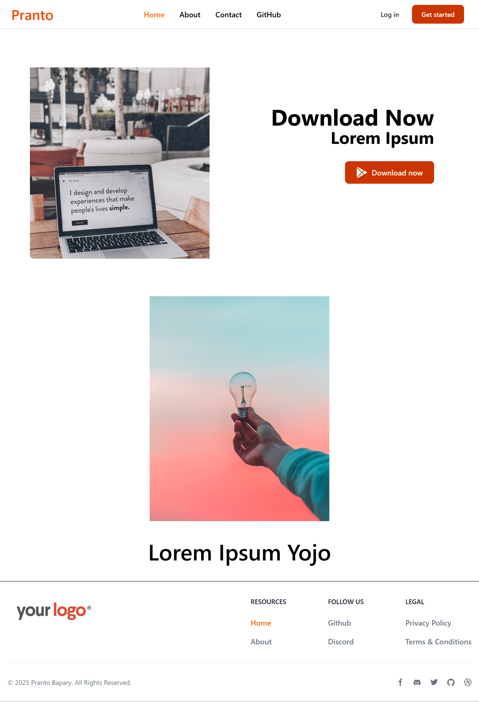

# 📘 Day 22 - React Router v7 Practice Project 2

<p align="center">
  
  
  
  
  
  
  
  
  
</p>

<p align="center">
Welcome to <b>Day 22</b> of my <b>60 Days of Coding Challenge</b>!  
Today, I learned and practiced the <b>core concepts of React Router v7</b>.  
I explored routing (static & dynamic), `<NavLink />` and `<Link />`, `<Outlet />` nesting, the **loader** pattern and `useLoaderData` for preloading route data, and programmatic navigation with `useNavigate`.  
As a hands-on project I built a small 4-page app with a fixed Navbar & Footer; pages render dynamically via `<Outlet />` and the active nav link is highlighted (orange). I also used a route loader to fetch my GitHub profile data and implemented a friendly 404 error page.
</p>

---

## 🎨 Features Implemented

- ✅ Static & Dynamic routing with **React Router v7**
- ✅ Navigation via `<Link />` and `<NavLink />` — active links styled with the `className` function (so the active item gets the orange color)
- ✅ Nested routes & layout composition using `<Outlet />` for shared Navbar/Footer
- ✅ Route **loader** functions to fetch data _before_ a route renders and `useLoaderData()` to access that data in the component
- ✅ Programmatic navigation with `useNavigate()` (for redirects, buttons, etc.)
- ✅ Custom **404 Error Page** (using route `errorElement` / Error Boundary) with a button to go back home
- ✅ Fetched GitHub profile (avatar + name) using a loader attached to a route
- ✅ Styled and made responsive using **Tailwind CSS**
- ✅ Deployed on **Netlify**

---

## 📚 Topics Revised

- 🔹 **Routing basics** — why client routing is used in SPAs
- 🔹 **Static vs Dynamic routes** — `path="/about"` vs `path="/user/:id"`
- 🔹 **NavLink** — use the `className` callback (receives `{ isActive, isPending }`) to apply active styles
- 🔹 **Outlet** — used in layout routes to render child routes without reloading the page
- 🔹 **Loader pattern** — attach `loader` functions to routes and read data with `useLoaderData()` in components (avoids janky loading states)
- 🔹 **useNavigate** — programmatic navigation (e.g. redirect after an action) — must be used inside a Router context
- 🔹 **Tailwind CSS** — responsive layout & utilities for navbar/footer styling

---

## 🛠️ Practice Work

- Set up a Vite + React app and added React Router v7
- Built a **Layout** component with **Navbar** and **Footer**; used `<Outlet />` to render pages
- Implemented pages: **Home**, **About**, **Contact**, **Github**
- Used **NavLink** `className` function to style the active link (orange)
- Created a route `loader` to fetch GitHub profile data (avatar, name) and used `useLoaderData()` in the component to consume it
- Implemented a **404** route (errorElement) that displays a friendly message and a button using `useNavigate()` to go home
- Styled everything using **Tailwind CSS** and deployed to Netlify

---

## 📂 Folder Structure

```plaintext
Day-22/
└── react-router-v7-practice/
    ├── src/
    │   ├── components/
    │   │   ├── Navbar.jsx
    │   │   ├── Footer.jsx
    │   │   ├── Home.jsx
    │   │   ├── About.jsx
    │   │   ├── Contact.jsx
    │   │   └── Github.jsx
    │   ├── App.jsx             # RouterProvider / route definitions (or main router file)
    │   ├── main.jsx           # entry point (createRoot, RouterProvider)
    │   └── index.css
    ├── public/
    ├── index.html
    ├── package.json
    └── README.md
```

---

## 🚀 Output Highlights

- ✨ Practiced React Router v7 features end-to-end

- ✨ Implemented pre-render data loading with route loaders + useLoaderData()

- ✨ Built nested layout with persistent navbar/footer and dynamic page rendering via <Outlet />

- ✨ Programmatic navigation implemented

- ✨ Polished UI using Tailwind CSS and deployed on Netlify 🎉

---

## 🎥 Preview

**Desktop Preview**

<p align="left"> 
 
</p>

---
