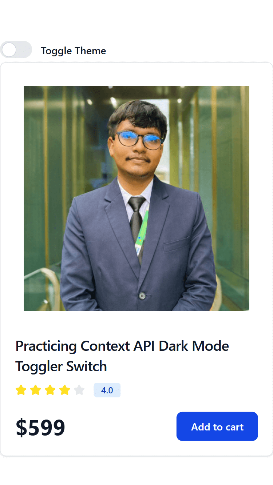
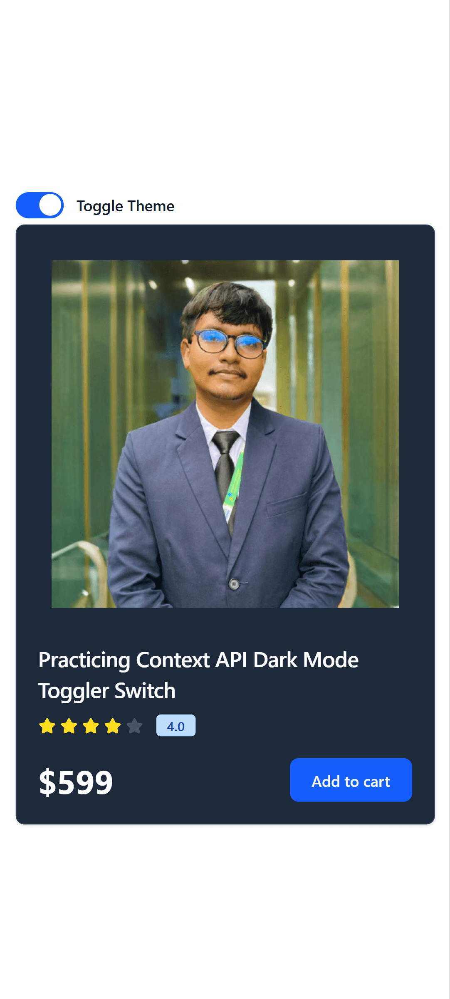

# 📘 Day 24 – React Context API (Theme Switcher)

<p align="center">
  
  
  
  
  
  
</p>

<p align="center">
Welcome to <b>Day 24</b> of my <b>60 Days of Coding Challenge</b> 🚀  
Today, I deepened my understanding of the <b>React Context API</b> by building a <b>Theme Toggle Switch</b> (Light / Dark mode).  
This practice helped me clearly understand how global UI state can be managed and updated across an entire application using Context.
</p>

---

## 🎯 What I Learned

- How to manage **global UI state** using Context API
- How to toggle state globally (light ↔ dark)
- How to consume and update context from multiple components
- How Context API simplifies cross-app UI behavior
- How theme state affects multiple components instantly

---

## 🛠️ Concepts Covered

- ✅ Global theme state management
- ✅ `createContext()`
- ✅ Context Provider pattern
- ✅ `useContext()` hook
- ✅ Conditional styling based on theme
- ✅ Clean and scalable state structure

---

## 🧪 Practice Implementation

- Created a global **Theme Context**
- Implemented **Light / Dark mode toggle**
- Shared theme state across components using Context
- Updated UI styles dynamically based on active theme
- Focused on logic clarity rather than visual complexity

---

## 🧠 Key Takeaways

- Theme switching is a **perfect real-world use case** for Context API
- Context makes global UI behavior simple and predictable
- Improves code readability and maintainability
- Avoids passing theme props through multiple components

---

## 📸 Screenshots

### 🌞 Light Mode
```html

```

### 🌙 Dark Mode
``` html

```
---
## 🔜 What’s Next

- Day 25 - Make a Todo App using Context API

---

### ✅ Day 24 Completed  
**Understanding Context API through real-world UI patterns**
