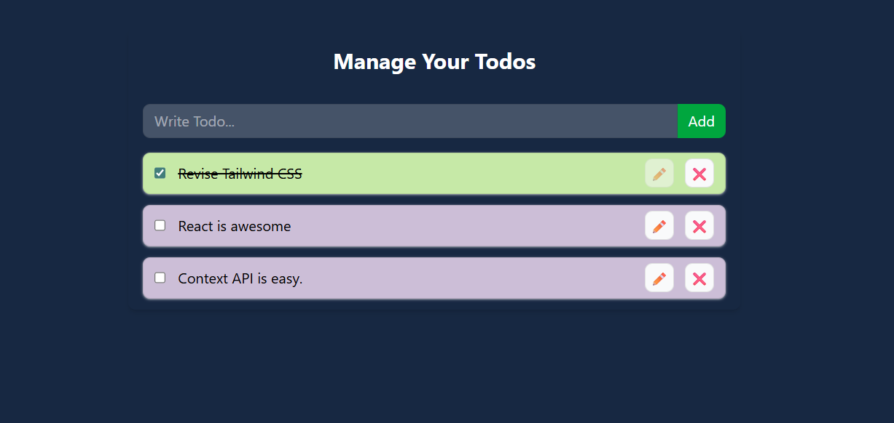

# 📘 Day 25 – React Context API (Todo App + LocalStorage)

  
  
  
  
  
  

Welcome to <b>Day 25</b> of my <b>60 Days of Coding Challenge</b> 🚀  
Today, I built a fully functional <b>Todo App</b> using <b>React Context API</b> with <b>LocalStorage</b> integration to understand global state management and data persistence in real-world React applications.

---

## 🌐 Live Demo

👉 **Live App:** https://react-context-todoapp.netlify.app/

---

## 🎯 What I Learned

- Managing global todo state using Context API
- Implementing CRUD operations (Create, Read, Update, Delete)
- Persisting state using `localStorage`
- Syncing Context state with browser storage
- Handling side effects using `useEffect()`

---

## 🛠️ Concepts Covered

- ✅ React Context API
- ✅ Global state management
- ✅ `createContext()` & Context Provider
- ✅ `useContext()` hook
- ✅ `useEffect()` for persistence
- ✅ Conditional rendering

---

## 🧪 Features Implemented

- ➕ Add new todos
- ✏️ Edit existing todos
- ✅ Mark todos as completed
- ❌ Delete todos
- 💾 Persist todos using LocalStorage
- ♻️ Todos survive page refresh

---

## 📸 Screenshots

### 📝 Todo App – Light Mode

---

## 🧠 Key Takeaways

- Context API is suitable for medium-scale applications
- Combining Context with LocalStorage improves UX
- Clean separation of logic makes apps scalable
- This pattern is common in real-world React apps

---

## 🔜 What’s Next

- Refactor Context logic using `useReducer`
- Add filters (All / Active / Completed)
- Prepare for Redux Toolkit

---

### ✅ Day 25 Completed  
**State management + persistence = real-world React**
