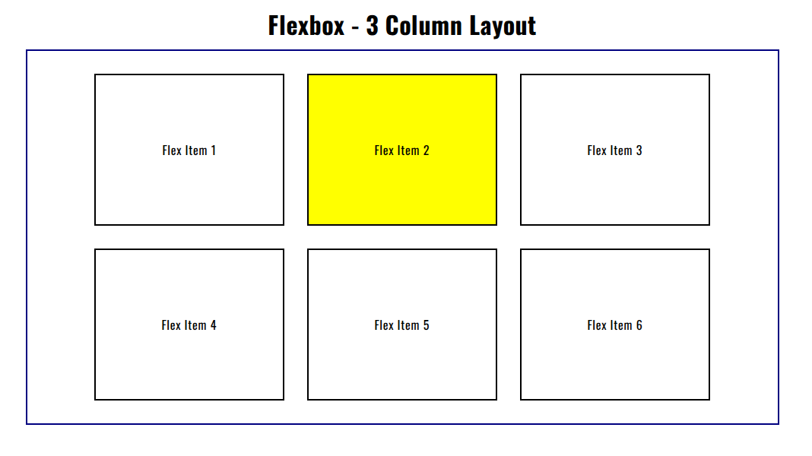
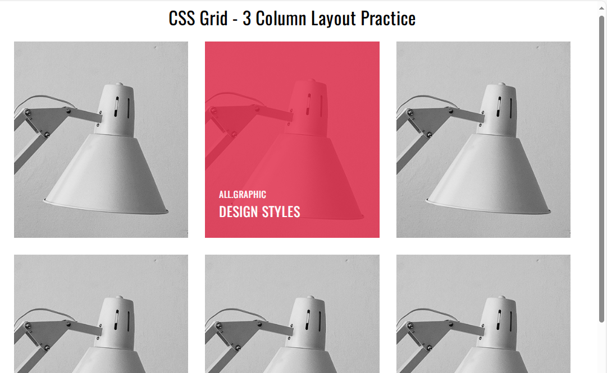

# 🚀 Day 4 - CSS Flexbox & Grid

## 📅 Challenge Timeline
- **Day 4** → Learned and practiced **Flexbox** & **CSS Grid**

---

## 📌 Overview
As part of my **60 Days of Code Challenge**, today’s focus was on mastering **layout systems** in CSS.  
I practiced creating layouts with **Flexbox** and **Grid**, which are essential for modern web design.

---

## 📂 Folder Structure
```
Day-4/
│── assets/
│ ├── css/
│ │ └── style.css
│ └── images/
│── flexbox.html
│── grid.html
└── README.md
```

---

## 🛠️ Features
- **Flexbox Layout:** Aligned items, justified content, flexible box sizing  
- **Grid Layout:** Created multi-column layouts, experimented with rows.  
- Built responsive structures without using external frameworks  

---

## 📸 Preview
(Add screenshots in `assets/images/` and update here)
- **Flexbox Layout:**   
- **Grid Layout:**   

---

## 🎯 What I Learned
- **Flexbox:** 
  - `justify-content`, `align-items`, `flex-wrap`, `flex-direction`  
- **Grid:**  
  - `grid-template-columns`, `grid-template-rows`, `gap`  
  - Understanding implicit vs explicit grid  

---

## ✅ Reflection
Flexbox and Grid are **powerful CSS layout tools**.  
Today I realized:
- Flexbox is best for **1D layouts** (row or column)  
- Grid is perfect for **2D layouts** (rows & columns combined)  

This knowledge will help me create **cleaner and more responsive web pages** in the future 🔥
