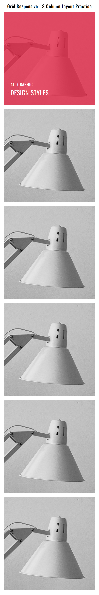
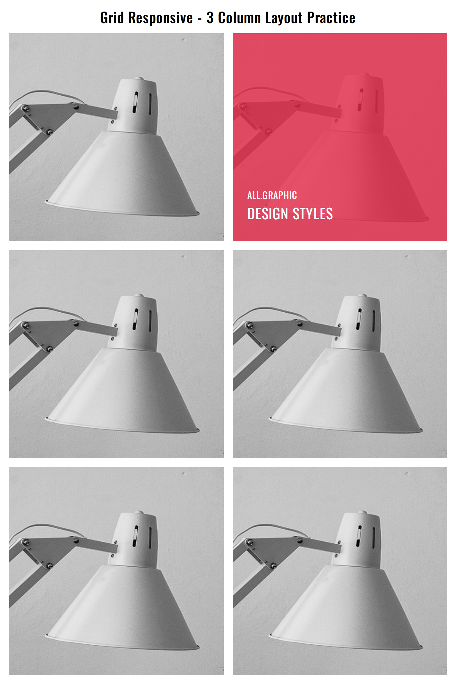
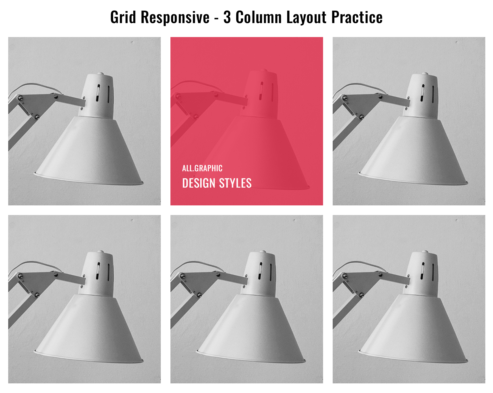
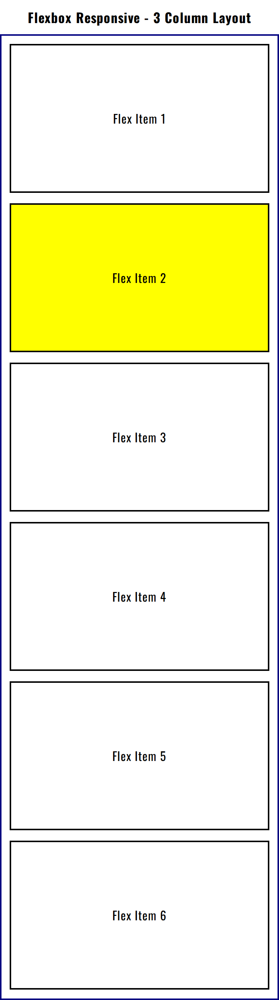
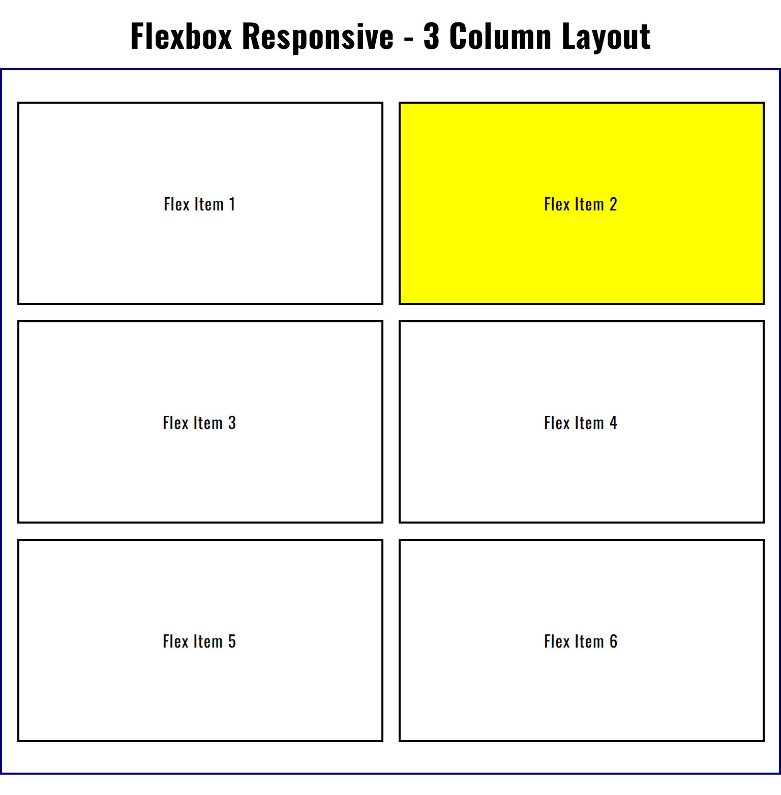
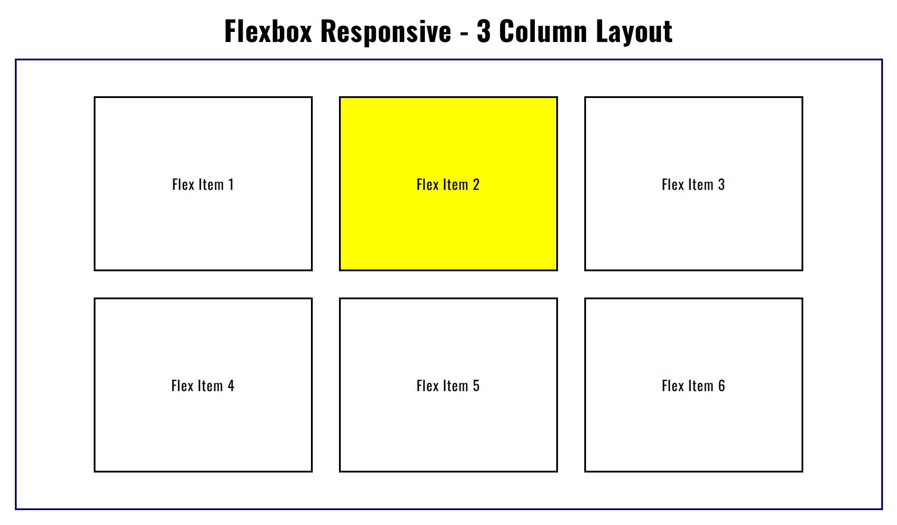

# 🚀 Day 5 - Responsive Design (Flexbox & Grid)

## 📅 Challenge Timeline

- **Day 5** → Practiced **Responsive Web Design** using **Flexbox** and **CSS Grid**.

---

## 📌 Overview

As part of my **60 Days of Code Challenge**, today’s focus was on making layouts **responsive across different screen sizes**.  
I built two separate responsive layouts:

- One using **Flexbox**
- One using **CSS Grid**

---

## 📂 Folder Structure
```
Day-5/
│── assets/
│ ├── css/
│ │ ├── flexbox_responsive.css
│ │ ├── grid_responsive.css
│ │ └── style.css
│ └── images/
│── flexbox_responsive.html
│── grid_responsive.html
└── README.md
```
---

## 🛠️ Features

- **Responsive Flexbox Layout:**

  - Used `flex-wrap`, `justify-content`, and `align-items`
  - Adjusted column/row direction with media queries

- **Responsive Grid Layout:**

  - Applied `grid-template-columns` with `repeat()` and `auto-fit/auto-fill`
  - Created adaptive grids for mobile, tablet, and desktop

- **Media Queries:**
  - Implemented breakpoints for **small (≤600px)**, **medium (≤900px)**, and **large (desktop)** screens

---

## 📸 Preview

- **Grid Layout (Mobile → Tablet → Desktop):** 
- 
- 

- **Flexbox Layout (Mobile → Tablet → Desktop):** 
- 
- 

---

## 🎯 What I Learned

- Applying **media queries** for multiple breakpoints
- Designing with a **mobile-first approach**
- Differences between **Flexbox** vs **Grid responsiveness**
- Using **relative units** (`em`, `rem`, `%`, `fr`) for flexible layouts

---

## ✅ Reflection

Responsive design is the **heart of modern frontend development** 🌍.  
By practicing both **Flexbox and Grid responsiveness**, I now feel more confident in creating layouts that adapt to all devices — from mobile to large desktop screens.  
This was a **big step toward real-world, production-ready development** 🔥
