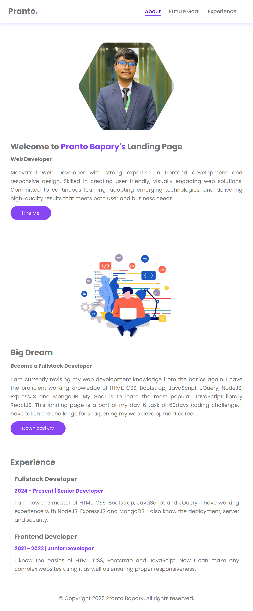
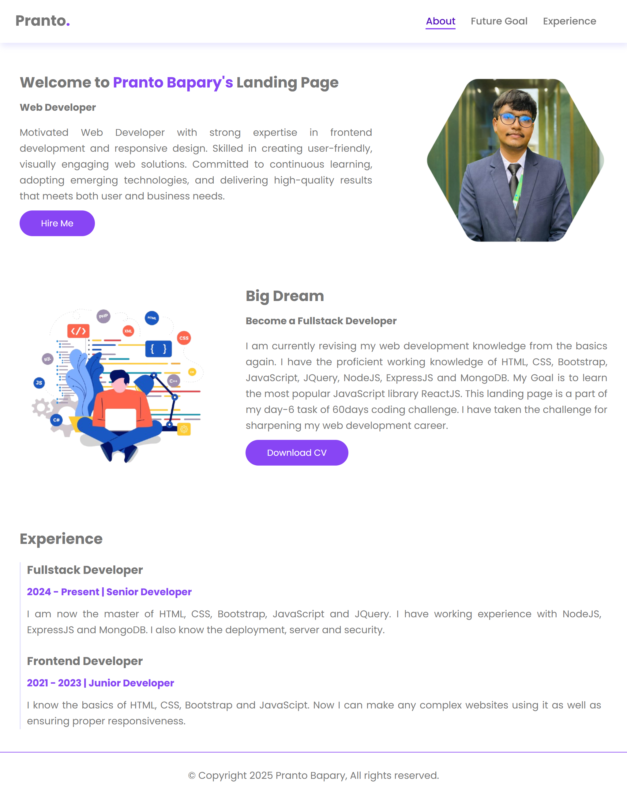

# 🚀 Day 6 - Mini Landing Page

## 📅 Challenge Timeline
- **Day 6** → Built a **fully responsive landing page** using everything I’ve recapped so far.

---

## 📌 Overview
On Day 6 of my **60 Days of Code Challenge**, I created a **mini landing page** from scratch.  
This project combined **HTML5 semantics, CSS fundamentals, Flexbox, Grid, and responsive design** into one cohesive page.  

The landing page includes **five structured sections**:
1. **Navigation Bar** (sticky at top)  
2. **Header** → Showcasing my introduction/info  
3. **Future Goals Section**  
4. **Experience Section**  
5. **Footer**  

---

## 📂 Folder Structure
```
│── assets/
│ ├── css/
│ │ └── style.css
│ └── images/
│── index.html
└── README.md
```

---

## 🛠️ Key Features
- **HTML5 Semantic Tags** → `header`, `nav`, `section`, `footer`  
- **Sticky Navbar** → Navigation stays fixed at the top  
- **Flexbox & Grid Layouts** → Structured sections with modern layouts  
- **CSS Selectors & Pseudo-classes** → `:hover`, `::before`, `::after` for interactivity  
- **Box Shadows & Hover Effects** → Polished, modern UI design  
- **Positioning** → `relative`, `absolute`, `sticky` for precise control  
- **Responsive Design** → Used `em`, `rem`, `%`, `fr`, `px` with **media queries** for mobile, tablet, and desktop  

---

## 📸 Preview

<p align="center">
  <br>
  <br>
  
</p>


---

## 🎯 What I Learned
- Building a **complete webpage** with multiple sections  
- Mastering **sticky navigation bars** with CSS positioning  
- Using **pseudo-elements** (`::before` and `::after`) for creative UI design  
- Combining **Flexbox & Grid** effectively for responsiveness  
- Designing with **mobile-first mindset** and scaling up  

---

## ✅ Reflection
This was my **first complete landing page** in the challenge, and it brought together everything I’ve revised so far.  
I’m proud of how the page turned out — clean, responsive, and structured.  
This project boosted my confidence to start building **more complex, real-world UIs** 🌟🔥
